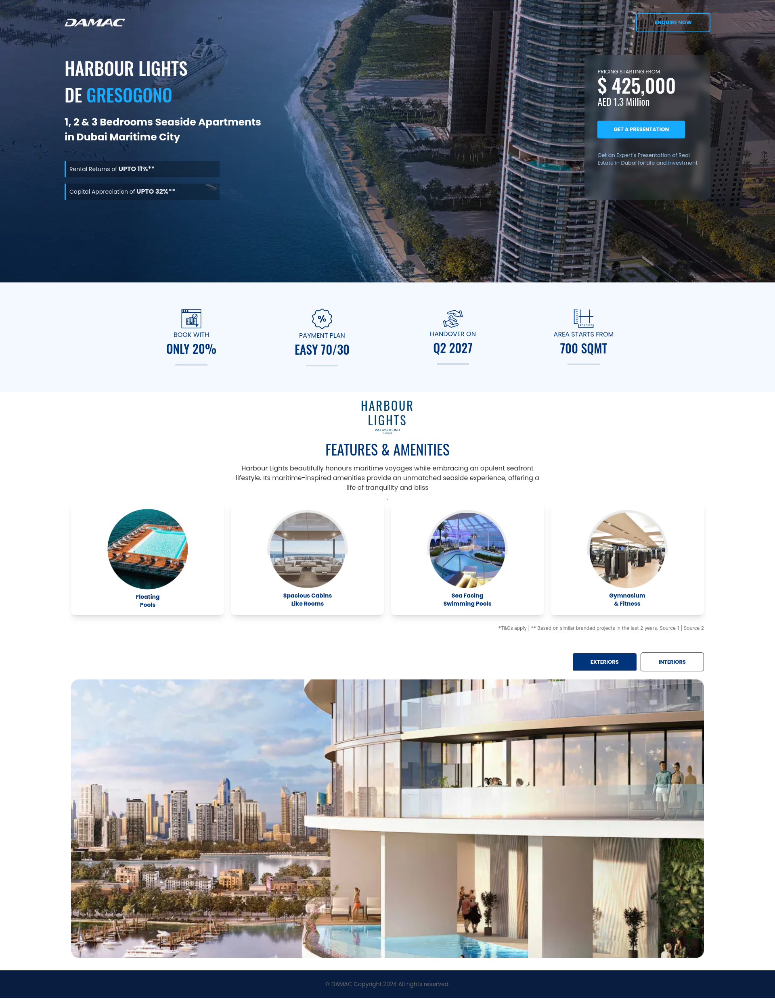

# Damac Project

This is a [Next.js](https://nextjs.org/) project bootstrapped with [`create-next-app`](https://github.com/vercel/next.js/tree/canary/packages/create-next-app).

## Project Screenshot



## Live Project

Check out the live project [here](https://damac-nine.vercel.app/).

## GitHub Repository

The source code for this project is available on GitHub: [https://github.com/brij1728/damac](https://github.com/brij1728/damac).

## Overview

This project was implemented using the following technologies:

- [**Next.js**](https://nextjs.org/): A React framework for server-side rendering and generating static websites.
- [**Tailwind CSS**](https://tailwindcss.com/): A utility-first CSS framework for rapid UI development.
- [**React Icons**](https://react-icons.github.io/react-icons/): A library for including popular icons in your React projects.
- [**Swiper**](https://swiperjs.com/): A modern touch slider and carousel library.
- [**Next/Image**](https://nextjs.org/docs/basic-features/image-optimization): An optimized image component for Next.js.

## Getting Started

First, run the development server:

```bash
npm run dev
# or
yarn dev
# or
pnpm dev
# or
bun dev
```
